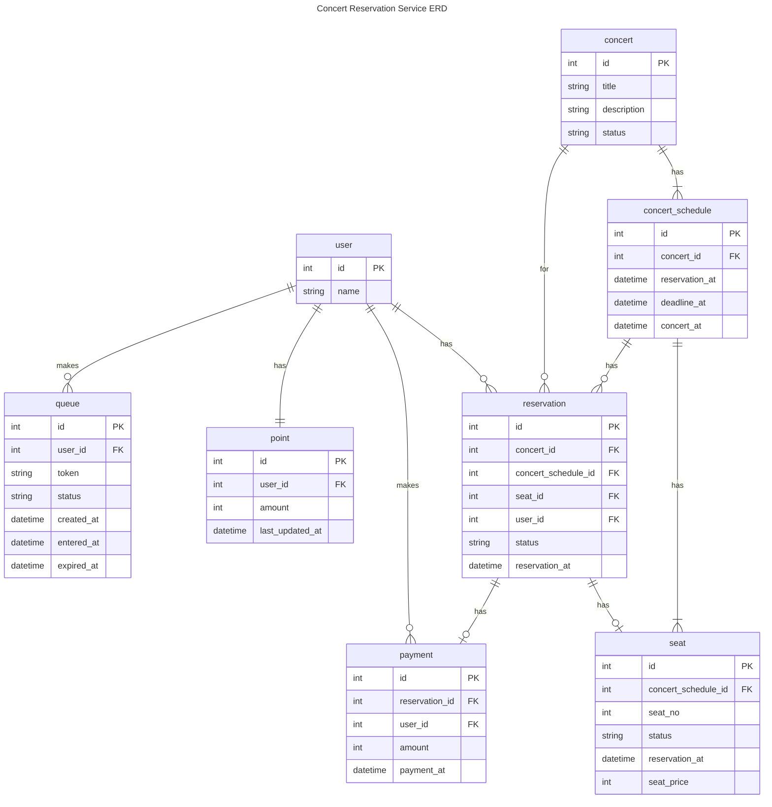

1. concert (콘서트 테이블)
  - `id`: 콘서트 고유 ID로 PK 설정
  - `title`: 콘서트 이름
  - `description`: 콘서트 설명
  - `status`: 콘서트 활성 상태 (AVAILABLE, UNAVAILABLE)

2. concert_schedule (콘서트 일정 테이블)
  - `id`: 콘서트 일정 고유 ID로 PK 설정
  - `concert_id`: 참조할 콘서트의 ID로 FK 설정
  - `reservation_available_at`: 예약 가능한 시각
  - `concert_at`: 콘서트 시각

3. seat (좌석 테이블)
  - `id`: 좌석 고유 ID로 PK 설정
  - `concert_schedule_id`: 참조할 콘서트 일정의 ID로 FK 설정
  - `seat_number`: 좌석 번호
  - `status`: 좌석 상태 (AVAILABLE, UNAVAILABLE)
  - `seat_price`: 좌석 가격

4. reservation (예약 테이블)   
  - `id`: 예약의 고유 ID로 PK 설정
  - `concert_id`: 참조할 콘서트의 ID로 FK 설정
  - `seat_id`: 참조할 좌석의 ID로 FK 설정
  - `user_id`: 참조할 사용자의 ID로 FK 설정
  - `status`: 예약 상태 (PAYMENT_WAITING, COMPLETE)
  - `reservation_at`: 예약 시각

5. payment (결제 테이블)
  - `id`: 결제 고유 ID로 PK 설정
  - `reservation_id`: 참조할 예약의 ID로 FK 설정
  - `user_id`: 참조할 사용자의 ID로 FK 설정
  - `amount`: 결제 가격
  - `payment_at`: 결제 시각
  - `status`: 결제 상태 (COMPELETE)

6. balance (잔액 테이블)
  - `id`: 잔액 고유 ID로 PK 설정
  - `user_id`: 참조할 사용자의 ID로 FK 설정
  - `amount`: 잔액
  - `last_updated_at`: 업데이트된 시각

7. queue (대기열 테이블)   
  - `id`: 대기열의 고유 ID로 PK 설정
  - `user_id`: 참조할 사용자의 ID로 FK 설정
  - `token`: 토큰
  - `created_at`: 토큰 생성 시각
  - `entered_at`: 대기열 활성화 시각
  - `expired_at`: 토큰 만료 시각

8. user (사용자 테이블)
  - `id`: 사용자 고유 ID로 PK 설정
  - `name`: 사용자 이름

### `concert`와 `concert_schedule`
    콘서트는 여러 개의 일정을 가질 수 있다.
    `concert_schedule` 테이블의 `concert_id`는 `concert` 테이블의 PK를 참조하는 외래키로 설정.

### `concert`와 `reservation`
    콘서트는 여러 개의 예약을 가질 수 있다.
    `reservation` 테이블의 `concert_id`는 `concert` 테이블의 PK를 참조하는 외래키로 설정.
    
### `concert_schedule`와 `seat`
    콘서트 일정은 여러 개의 좌석을 가질 수 있다. 
    `seat` 테이블의 `concert_schedule_id`는 `concert_schedule` 테이블의 PK를 참조하는 외래키로 설정.

### `reservation`와 `seat`
    좌석은 예약을 여러 개 가질 수 있다.
    'reservation` 테이블의 `seat_id`는 `seat` 테이블의 PK를 참조하는 외래키로 설정.
    
### `reservation`와 `payment`
    하나의 예약은 하나의 결제가 이루어진다.
    `payment` 테이블의 `reservation_id`는 `reservation` 테이블의 PK를 참조하는 외래키로 설정.

### `user`와 `payment`
    사용자는 여러 번 결제할 수 있다.
    `payment` 테이블의 `user_id`는 `user` 테이블의 PK를 참조하는 외래키로 설정.
    
### `user`와 `reservation`
    사용자는 여러 번 예약할 수 있다.
    `reservation` 테이블의 `reservation_id`는 `user` 테이블의 PK를 참조하는 외래키로 설정.

### `concert`와 `reservation`
    콘서트는 여러 개의 예약이 생성될 수 있다.
    `reservation` 테이블의 `concert_id`는 `concert` 테이블의 PK를 참조하는 외래키로 설정.
    
### `user`와 `balance`
    하나의 사용자는 하나의 잔고를 확인 할 수 있다.
    `balance` 테이블의 `user_id`는 `user` 테이블의 PK를 참조하는 외래키로 설정.

### `user`와 `queue`
    사용자는 여러 개의 대기열 정보를 가질 수 있다. (예: 만료되어 다시 대기열 순위에 등록하는 경우)
    `queue` 테이블의 `user_id`는 `user` 테이블의 PK를 참조하는 외래키로 설정.
